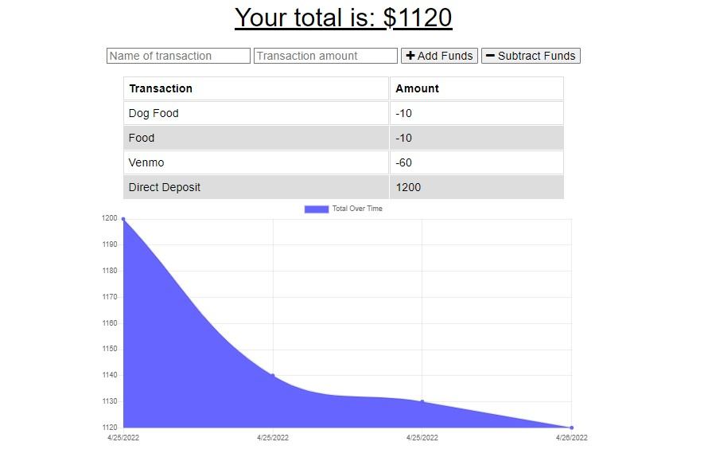

# Off Budget

### Description
This full stack web application is a Progressive Web Application (PWA) that is hosted live by Heroku. The user will be able to add expenses and deposits to their budget with or without a connection. If the user enters transactions offline, the total should be updated when they're brought back online. It utilizes some popular packages that include MongoDB, IndexedDB, Express and more!
### License

This application is licensed under MIT

### Application Demo

### Table of Contents
- [Description](#description)
- [Contributing](#contributing)
- [Tests](#tests)
- [Questions?](#questions)

### Contributing
No contributions at this time.

### Tests
N/A

### Questions
GitHub Username: (kcaseychamberlain) 

View the project in GitHub at: https://github.com/KCaseyChamberlain/off-budget

View the application live hosted by Heroku at: https://thawing-basin-23278.herokuapp.com/
    
If you have any questions, contact Casey at: caseygchamberlain@gmail.com